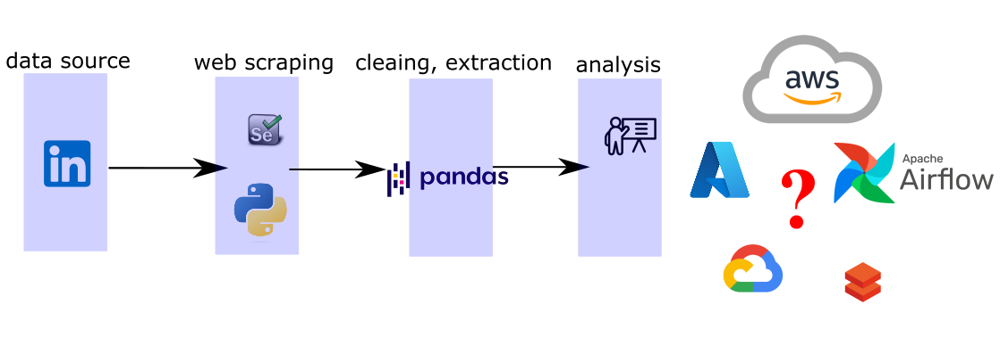
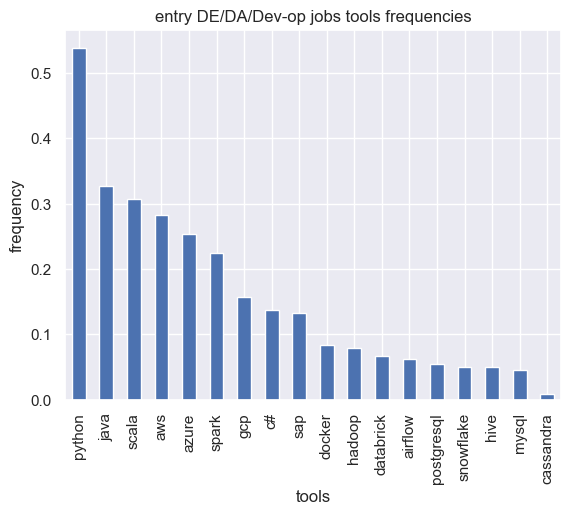
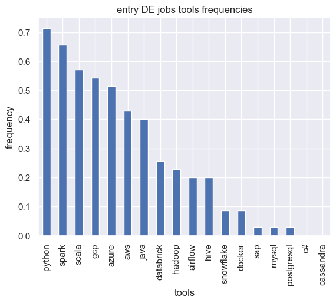
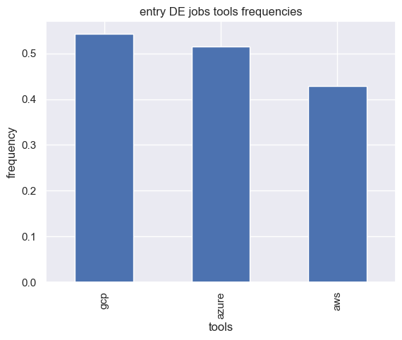
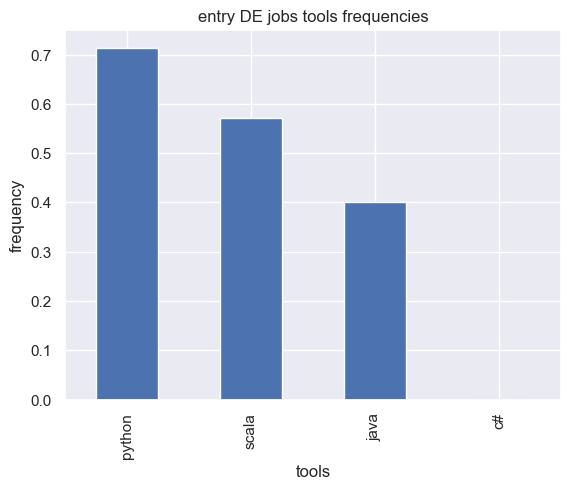
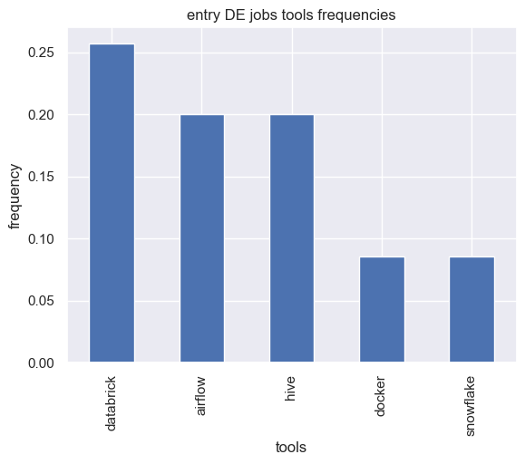

# Hot skills used for DE

## Project Introduction
The skills in the world of data engineer (DE) could be overwhelming to beginners who wish to start a career as a data engineer. One often struggles with which tool should i learn first, which could provider should i learn first. This work is designed to help with those who wishes to understand how to spend their time on learning skills that have a higher chance to get you employeed.

This is the work flow for the project.



The main four parts are shown below:
- `linkedin`: for providing job posting and job descriptions.
- `python selenium`: for web scrapping and interacting with linkedin job pages.
- `pandas`: for cleaning, wrangling and tranforming data into busines logics.
- `analysis`: analyze what skills to learn for a DE.


## Background
It needs to be addressed that linkedin data has been scraped with the following limitations:
```json
{
    "collection_date": "20230211",
    "linkedin_search_bar":"data engineer",
    "location":"toronto,ontario,canada",
    "experience_level":"entry level",
    "job_post_date":"past month"    
}
```
With the limitation of the data the following results will be more applicable for junior DE positions in data engineer.

Another thing that is worth mentioning that on linkedin, if you serach for `data engineer`, the job posts have been sorted based on relevance. After 50ish job posting, `dev-op engineer` and `SDE` will pop up.

In order to be more specific, the sample sizes have been grouped into two categories:
- `total`: for the past month, there are 242 jobs post if you search entry level DE near Toronto. It is not much but it is the most up-to-date one for now.
- `DE-only`: a filter has been done to locate `job title` contains the word `daTa EnGinEEr` (case insensitive filter), it sums up to 35 jobs in total.


## Results and discussion

### Tools frequencies

The top tools for both groups are shown in the figures below. 

Total (242 data points)             |  DE-only (35 data points)
:-------------------------:|:-------------------------:
  |  

For the scope of diccusion, we will focus on the DE-specific group now, the top three elements are python, spark, scala with over 50% frequencies.


### Cloud vendor

In terms of cloud vendors, it is almost a tie between big three. It is worth mentioning that it is `DE-only` group (35 data points), it might not be that statisticaly significant but it gives you an overview how they shoare the market.




### Programming language


Not gonna rank for programming language but python, scala and java are the top three language for getting employed fast as an entry DE.



## Others

Orchestration tools and other hot-hit tools have been given here. databrick, airflow are definitely top of the list and it should give you confidence that you should definitely belive in yourself that you are on the right track and you will ace it.




## Conclusion and recommendation
In this project, the tools related to DE has been ranked based on frequencies shown in the job posts on linkedin. In the future, there are a couple of room for improvement 
- combination of tools will be investigated to investigate the ecosystem
- batch processing and orchestation will eaisly upgrade this project from DA to DE level.
